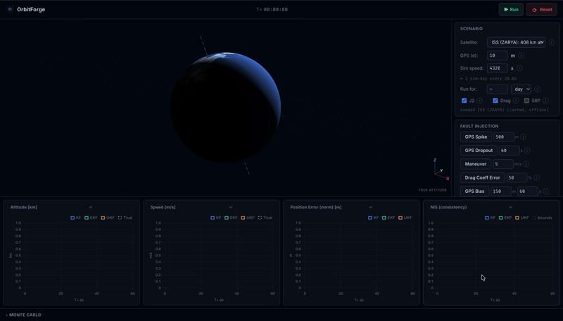

# OrbitForge

Real satellite orbits and Kalman filters. Runs entirely in the browser, no server.

**Live Site:** [orbitforge.pages.dev](https://orbitforge.pages.dev)



## Overview

OrbitForge loads a real satellite's orbital elements (TLE) and runs three state estimation filters against it side by side: a linear **KF**, an **EKF**, and a **UKF**. All three see the same noisy sensor data and try to recover the satellite's true position and attitude. You can inject faults mid-run, compare how each filter responds, and run full Monte Carlo consistency campaigns.

The entire simulation, all three filters, and the sensor models are **C++17 compiled to WebAssembly**. The browser only renders.

## Features

- Live TLE feed from CelesTrak, or paste your own
- Three filters running concurrently against identical measurements: **KF** (linear baseline), **EKF**, **UKF**
- 6DOF attitude estimation: 12-state multiplicative EKF/UKF, rigid body dynamics, gyroscope + magnetometer
- Fault injection: GPS spike, GPS dropout, unmodeled maneuver, drag coefficient error, persistent GPS bias
- Configurable Monte Carlo campaigns: filter choice, run count & duration, process noise, fixed or random seed
- NEES / NIS consistency charts against theoretical chi-squared bounds
- WebGL2 3D view: orbit path, true attitude, covariance ellipsoids
- Real-time Chart.js panels for position error, velocity error, covariance trace, NIS

## Architecture

The simulation runs on a dedicated Web Worker at a fixed **100 Hz**, independent of render rate. Each tick writes a state snapshot into a lock-free ring buffer backed by a `SharedArrayBuffer`. The main thread reads from that buffer at 60 fps for rendering.

```
Main thread (UI, WebGL2)  <--  SharedArrayBuffer ring buffer  <--  Worker (100 Hz physics + filters)
```

Key decisions:

- **Lock-free ring buffer.** Producer and consumer never block each other. Read/write head pointers are padded onto separate cache lines to avoid false sharing.
- **Monte Carlo runs on a 4-thread pool inside WASM** (real OS threads via Emscripten pthreads). A 5000-run, 500-step campaign is 2.5 million filter updates and finishes in under two seconds.
- **Live progress without blocking.** The Monte Carlo call blocks the worker for its full duration. A separate atomic counter, polled directly off the shared heap by the main thread, drives the progress bar without waiting on a response message.
- **KF stays 6-state on purpose.** It is the deliberately naive baseline the other two filters are compared against, not an incomplete feature.

See [docs/architecture.md](docs/architecture.md) for the full design and [docs/math.md](docs/math.md) for every filter Jacobian derivation.

## Getting Started

### Prerequisites

- CMake >= 3.18
- A C++17 compiler
- Eigen3 (`brew install eigen` on macOS, `apt install libeigen3-dev` on Ubuntu)
- Node.js and npm
- [Emscripten SDK](https://emscripten.org/docs/getting_started/downloads.html) 3.1.50 (only needed to build the WASM bundle)

### 1. Build and test the engine (native, no Emscripten needed)

```bash
cmake -B build -DCMAKE_BUILD_TYPE=Debug engine/
cmake --build build -j$(nproc)
cd build && ctest --output-on-failure
```

### 2. Build the WASM bundle

```bash
# one-time setup
git clone https://github.com/emscripten-core/emsdk.git /opt/emsdk
/opt/emsdk/emsdk install 3.1.50
/opt/emsdk/emsdk activate 3.1.50

# build
./scripts/build_wasm.sh
```

This produces `web/public/orbitforge.wasm` and `web/public/orbitforge.js`.

### 3. Run the web app

```bash
cd web
npm install
npm run dev
```

The dev server sets the `Cross-Origin-Opener-Policy` and `Cross-Origin-Embedder-Policy` headers `SharedArrayBuffer` requires. Without them the WASM module will fail to load with a cross-origin isolation error.

## Project Structure

```
engine/      C++17 simulation core: dynamics, filters, sensors, Monte Carlo, WASM bindings
web/         TypeScript frontend: WebGL2 renderer, UI, worker, WASM bridge
docs/        Architecture, math derivations, benchmarks
scripts/     Build scripts (WASM build, native benchmarks)
```

Further reading: [docs/architecture.md](docs/architecture.md), [docs/math.md](docs/math.md), [docs/benchmarks.md](docs/benchmarks.md).
