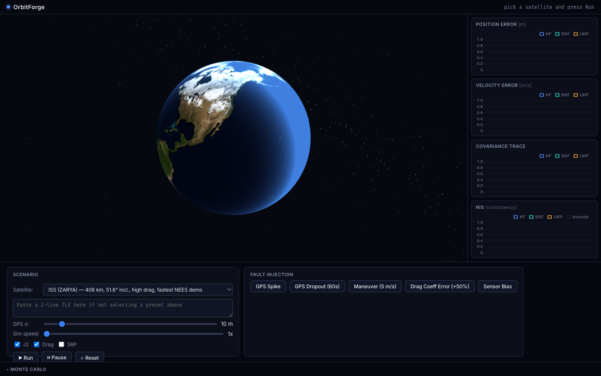

# OrbitForge

**Live spacecraft state estimation — real satellites, real filters, runs in your browser.**

[orbitforge.dev](https://orbitforge.dev) — zero install, works offline after first load.

---



Load any real satellite's TLE, watch KF / EKF / UKF run against simulated sensor noise, inject faults, and see filter divergence in real time. All computation runs in a C++17 WebAssembly engine at near-native speed — no server, no backend.

## What makes this different

| Tool | Gap |
|------|-----|
| Orekit (Java) | CLI/API only, no browser, no filter comparison |
| nyx (Rust WASM) | Propagation only — no state estimation, no sensors |
| orbidet (Python) | Notebook-only, not interactive |
| MATLAB toolbox | Requires license, offline |

OrbitForge is the first tool that combines real TLE data + EKF/UKF filter comparison + fault injection + WASM — all running in the browser.

## Build

### Engine (C++17, native — tests and benchmarks)

```bash
# Requires: cmake, Eigen3, internet (GTest fetched automatically)
cmake -B build -DCMAKE_BUILD_TYPE=Debug engine/
cmake --build build -j$(nproc)
cd build && ctest --output-on-failure
```

### Web (TypeScript + WASM)

```bash
cd web
npm install
npm run dev      # local dev server with COOP/COEP headers
npm run build    # production build to web/dist/
```

The production build requires the WASM artifacts (`orbitforge.wasm`,
`orbitforge.js`) to have been built first via `scripts/build_wasm.sh`
(Emscripten) — see [docs/architecture.md](docs/architecture.md) for the
full toolchain.

## Architecture

See [docs/architecture.md](docs/architecture.md), [docs/math.md](docs/math.md),
and the build log in [docs/checkpoint.md](docs/checkpoint.md).

## Status

- [x] Phase 1 — C++ engine (EOM, RK4/RK45, KF/EKF/UKF, sensors, tests, benchmarks)
- [x] Phase 2 — WASM build + lock-free memory systems (ring buffer, pool allocator, fault injector, Simulation class, web scaffold)
- [x] Phase 3 — WebGL2 renderer + Monte Carlo UI + fault injection + live TLE feed (5 satellite presets verified end-to-end)
- [ ] Phase 4 — Cloudflare Pages deploy

Phase 1: 33/33 tests passing; benchmarks in [docs/benchmarks.md](docs/benchmarks.md) — all metrics 13–32x inside target.
Phase 2: 63/63 tests passing; ring buffer throughput 3.46×10⁸/sec (69× target); WASM compile verified in CI.
Phase 3: WebGL2 Earth/orbit/covariance renderers, Chart.js error/NIS/NEES panels, Monte Carlo UI, fault injection controls, and live CelesTrak TLE feed all implemented and verified against real network data — see [docs/checkpoint.md](docs/checkpoint.md).
